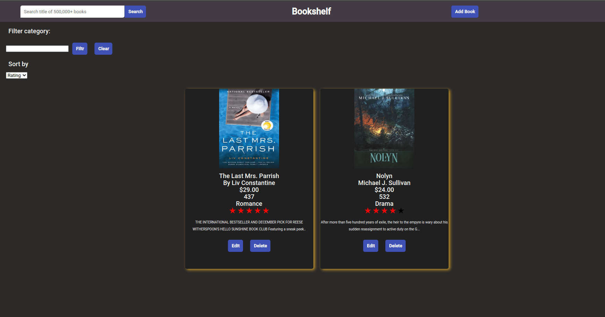

# Bookshelf

# Description
Project which combines `angular framework` && `python fastapi` backend and `docker` technology.



# Setup

1. create `.env` file and fill it in (env-template)
2. add volume permissions to run `pgadmin`


```
sudo chown -R 5050:5050 volumes/pgadmin
```

3. Run docker compose
```
docker-compose up
```


4. go to `localhost:80` and configure connection to local postgres db:
```
host: localhost
port: 5432
maintenance db: postgres
username: POSTGRES_PASSWORD (from .env)
password: POSTGRES_USER (from .env)
```

# Frontend


This project was generated with [Angular CLI](https://github.com/angular/angular-cli) version 12.2.0.

## Development server

Run `ng serve` for a dev server. Navigate to `http://localhost:4200/`. The app will automatically reload if you change any of the source files.

## Build

Run `ng build` to build the project. The build artifacts will be stored in the `dist/` directory.


# Backend

1. Create virtualenv
2. Install packages `pip3 install -r requirements.txt`
3. Run command:
```
uvicorn main:app --reload --port 8080
```
